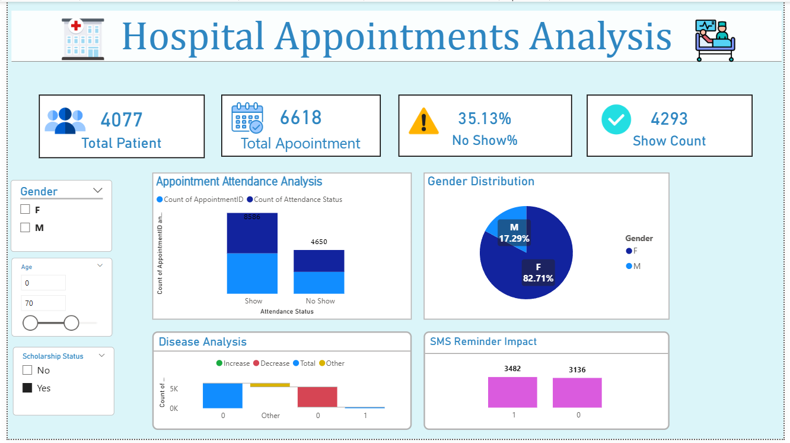

# 🏥 Hospital Appointment Analysis Dashboard

An interactive Power BI dashboard designed to analyze hospital appointment data and generate actionable insights.

## 📊 Key Insights
✔ Total Patients & Appointments Overview  
✔ No-Show Rate Analysis (35.13%)  
✔ Gender Distribution of Patients  
✔ Disease Trend Analysis  
✔ Impact of SMS Reminders on Attendance  

## 🛠 Tools & Technologies
- Power BI
- Power Query (Data Cleaning & Transformation)
- Data Visualization Techniques

## 📷 Dashboard Preview

## 🎯 Project Objective
This project demonstrates my ability to clean, analyze, and visualize healthcare data to support decision-making.

## 👨‍💻 Author
**Saeed Shaikh**  
Aspiring Data Analyst
